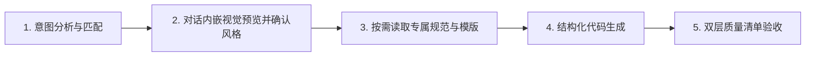

# Visual HTML — 模块化视觉设计与长文本排版系统

核心使命：**将长篇纯文本（如调研报告、方案白皮书、产品规划、技术总结、深度案例等）转换为结构清晰、高可读性、高辨识度且极具视觉美感的单文件 HTML 页面与 16:9 PPT 演示文稿**。

本 Skill 采用**插件化风格包（Pluggable Style Packs）**架构，在保证长文本排版骨架高可读性与结构一致性的同时，支持多种独立演进的视觉风格。

---

## 1. 风格注册表 (Style Registry)

当前系统内置的风格包列表以 `references/styles/registry.json` 为机器可读真相源。每种风格均包含独立的 `design.md`、`scaffold-web.html`、`scaffold-ppt.html`、矢量源文件 `preview.svg`，以及供对话直接渲染的微缩视觉名片 `preview.png`：
> 🎨 **查看全部风格**：按下方流程启动本次选择会话后，把命令输出的带 `?key=` URL 作为 [查看全部风格] 链接；这样画廊中的“使用此风格”才能回传到当前对话。只有 Companion 无法启动时，才回退为当前 Skill 目录下的 `references/style-gallery.html` 文件链接。

| Style ID | 风格名称 | 核心视觉特征 | 推荐场景与关键词 | 微缩预览与风格包 |
|---|---|---|---|---|
| **`industrial-dark`** | **暗黑极客工业风**<br>(Industrial Dark) | 近黑背景 (`#090C0B`) + CAD 极淡网格 + 0–2px 硬边模块 + 信号绿 (`#67E38B`) + 紫色第二通道 | 硬件参数页、产品官网、工程文档、技术说明、极客展示、系统架构 | [预览名片](references/styles/industrial-dark/preview.png)<br>`references/styles/industrial-dark/` |
| **`soft-sky`** | **清透空灵浅蓝风**<br>(Soft Sky) | 浅天蓝渐变背景 + 半透明白色卡片 + 8–16px 柔和圆角 + 同色系高阶蔚蓝 (`#0284C7`) 强调通道 | 包装展示、生活方式产品、消费级硬件、手账/文具、清新雅致向技术页 | [预览名片](references/styles/soft-sky/preview.png)<br>`references/styles/soft-sky/` |
| **`obsidian-cyan`** | **黑曜霓蓝展厅风**<br>(Obsidian Cyan) | 黑曜近黑底色 (`#0B0E14`) + 顶部冷蓝极光 + 悬浮设备模型 + 电光霓蓝 (`#38BDF8`) 信号与标注线 (Callout Pins) + 多步流程徽章 | UI/UX 案例集、移动端 App 展示、数字产品发布、前沿软件功能演示、高科技展厅 | [预览名片](references/styles/obsidian-cyan/preview.png)<br>`references/styles/obsidian-cyan/` |
| **`neon-3d`** | **暗紫流体极光风**<br>(Neon Aurora) | 深邃黑紫底色 + 流体极光光晕 (Fluid Aurora Wave) + 胶片颗粒噪点 (Film Grain) + 3D浮雕高光卡片 + 霓虹紫/洋红通道 (`#A855F7` / `#EC4899`) | 工具集合展示、创意应用、潮酷硬件、潮流设计工作室、流体极光落地页、蒸汽波质感 | [预览名片](references/styles/neon-3d/preview.png)<br>`references/styles/neon-3d/` |
| **`pixel-pop`** | **日系像素波普风**<br>(Pixel Pop) | 青春亮蓝底色 (`#0055ff`) + 浅奶油看板画布 + 粗黑边框与 5px 偏移硬投影 + 悬浮像素碎片与涂鸦 | 青春校园、创意活动、复古游戏、手账拼贴、动漫手绘风展示 | [预览名片](references/styles/pixel-pop/preview.png)<br>`references/styles/pixel-pop/` |
| **`brutalist-acid`** | **先锋撞色海报风**<br>(Brutalist Poster) | 纯白高对比度画布 + 亮粉几何色块 (`#FF4591`) + 荧光青色 (`#00E5CC`) 超大字号标题 + 破坏性排版与紧凑字距 | 艺术展览、独立出版物、实验性排版、先锋设计展示、海报视觉冲击 | [预览名片](references/styles/brutalist-acid/preview.png)<br>`references/styles/brutalist-acid/` |
| **`sunflower-bloom`** | **向日葵暖阳风**<br>(Sunflower Bloom) | 沉静纸质蓝背景 (`#4278A9`) + 米白奶油字 (`#F2EAE0`) + 向日葵明黄 (`#FFC300`) 高亮与强调色 + 粗大排版 | 产品海报、积极向上展示、生机活力传递、纸质文艺风格、团队文化 | [预览名片](references/styles/sunflower-bloom/preview.png)<br>`references/styles/sunflower-bloom/` |
| **`summer-dopamine`** | **夏日多巴胺风**<br>(Summer Dopamine) | 高饱和渐变网格背景 + 毛玻璃大圆角卡片 + 纯白与发光元素点缀 | 夏日活动、创意产品、汽水风格、多巴胺设计、元气海报 | [预览名片](references/styles/summer-dopamine/preview.png)<br>`references/styles/summer-dopamine/` |
| **`warm-craft`** | **温润纸感手札风**<br>(Warm Craft) | 暖米纸质画布 (`#F7F4EC`) + 人文宋体大标题 (Editorial Serif) + 深橄榄绿行动通道 (`#323D24`) + 错落微倾粉彩贴纸 (`-2deg`~`+2deg`) + 手绘涂鸦 | 智能代理、知识沉淀、深度调研、SaaS 产品官网、人文科技、书籍出版物、温润工作流 | [预览名片](references/styles/warm-craft/preview.png)<br>`references/styles/warm-craft/` |
| **`soft-editorial-future`** | **极简未来展厅风**<br>(Future Showroom) | 偏冷质感画布 + 高光悬浮玻璃展柜 + 内部色彩温润晕开的 3D 柔光彩球散布（边缘柔和自然） | 高级展厅、视觉画廊、艺术展落地页、前沿科技、AI产品、高端发布会 | [预览名片](references/styles/soft-editorial-future/preview.png)<br>`references/styles/soft-editorial-future/` |
| **`play-tubular`** | **玩味极客彩管风**<br>(Play Tubular) | 浅暖米白点阵画布 (`#FAF8F3`) + 粗圆鲜活 3D 渐变立体彩管/丝带环绕 + 球头末端与弯折处的 **半调网点 (Halftone Dot Matrix)** 光影 + 现代高对比度工程粗黑体 + 纯白大圆角弹簧动效卡片 | AI/LLM 创新展示、创意产品发布、工程技术白皮书、开发者大会、玩味科技落地页 | [预览名片](references/styles/play-tubular/preview.png)<br>`references/styles/play-tubular/` |
| **`nothing-design-dark`** | **Nothing 极简点阵暗黑风**<br>(Nothing Monochrome Dark) | OLED 纯黑背景 (`#000000`) + 24px 点阵网格 + Doto 点阵字 + 多通道遥测色（珊瑚橙 `#FF5722`、翡翠绿 `#22C55E`、琥珀金 `#F59E0B`）+ 18 项标准长文语义骨架 + 分段刻度条 | 硬件工业设计、前沿数码发布、技术规格书、深度研究白皮书、瑞士排版工程文档、夜间长篇报告 | [预览名片](references/styles/nothing-design-dark/preview.png)<br>`references/styles/nothing-design-dark/` |
| **`nothing-design-light`** | **Nothing 极简点阵亮白风**<br>(Nothing Monochrome Light) | 陶瓷冷白背景 (`#FFFFFF`) + 浅灰点阵网格 + Doto 点阵字 + 纯黑正文 + 多通道功能色（信号红 `#D71921`、翡翠绿 `#16A34A`、琥珀金 `#D97706`）+ 18 项标准语义骨架 | 白瓷工业设计、白皮书、现代印刷质感报告、硬件参数发布、极简日间阅读、学术出版物 | [预览名片](references/styles/nothing-design-light/preview.png)<br>`references/styles/nothing-design-light/` |
| **`pixel-crystal`** | **油画粉彩晶光风**<br>(Pixel Crystal) | 温润油画布纹 (`#FDF8F7`) + 莫奈复调渐变 + 晶透苹果图腾 + 点彩星芒 + 珍珠母贝画板 + 熟褐暗茜草墨色正文 (`#3C2836`) | 艺术企划、文化出版、Vtuber、梦幻生活方式、独立游戏、高端少女心与治愈系产品、创意插画案例集 | [预览名片](references/styles/pixel-crystal/preview.png)<br>`references/styles/pixel-crystal/` |
| **`ink-bamboo`** | **青绿水墨竹韵风**<br>(Ink Bamboo) | 古法宣纸暖底 (`#F6F4EE`) + 右侧水墨竹节竿影 + 古典宋体大标题 + 翠竹生青 (`#5A8F43`) + 朱砂印章点睛 (`#C03E2D`) + 矿物青绿色谱 | 中式文化企划、行业深度研报、学术白皮书、东方文创展示、自然生态战略、高端政企汇报 | [预览名片](references/styles/ink-bamboo/preview.png)<br>`references/styles/ink-bamboo/` |

> 💡 **未来扩展**：新增风格只需在 `references/styles/<style_id>/` 目录下添加设计规范、脚手架、矢量源文件 `preview.svg` 与对话预览 `preview.png`，并同步在 `style-gallery.html` 与本表中注册即可。

---

## 2. 共享设计骨架 (Shared Skeleton DNA)

所有风格共享同一套信息骨架，确保任何风格下都具备高级的设计质感：

1. **信息结构本身就是视觉**：优先使用大字号标题、严格左对齐、模块化卡片、编号系统、标签、1px 细边框、Mono 等宽元数据与规格栏建立视觉身份，而非堆砌插画、3D、高光渐变与 emoji。
2. **克制优先于装饰**：
   - 能用排版解决就不加图形；能用边框解决就不加阴影；
   - 能用字号解决就不加颜色；能用留白解决就不加装饰；
   - 信号色仅占 3–7%，必须承担明确的语义/状态（如 Eyebrow 标头、序号、选中态、关键指标）。
3. **大标题负责观点，正文负责解释**：Hero 标题短小、字重大、有冲击力，支持中文语义主动换行；每页或每个 Section 只有一个唯一视觉焦点。

---

## 3. 标准执行工作流 (Standard Workflow)



### 第一步：意图分析与交互确认（视觉卡片推荐）

本 Skill 触发后，**不要直接生成全部代码**。首先分析用户需求与偏好：

1. **已明确指定**：若用户已明确指定风格（如“用浅蓝风”、“Industrial Dark”、“Play Tubular”），直接锁定对应 `style_id`。
2. **基于图像参考（多模态设计逆向工程）**：如果用户提供了一张**设计参考图**，请先执行解构分析：
   - 提取全局底色（背景）。
   - 提取核心信号色（品牌色、高光色、渐变色）。
   - 提取形状特征（圆角大小、卡片阴影质感、3D或扁平）。
   - 提取排版特征（字重、留白、边框风格）。
   - **完成分析后，严格遵守“Clean Room Design”法则，不要继承旧模板，直接从 `references/_base-scaffold-web.html` 读取基座并在其上编写全新 CSS**，以防止硬编码污染。
3. **智能推荐机制（输出 3～5 款设计风格）**：
   - 当用户提供了长文或排版需求但未锁定风格，或者意图较为宽泛时，分析文本特征并挑选 **最契合的 3～5 套风格**。
   - **对话内嵌视觉预览（强制）**：在同一条推荐回复中，用 Markdown 图片直接展示每个候选风格的 `preview.png`，然后再给出文字说明。用户必须能在对话流中看见实际色彩、构图和组件质感后再选择。
     - 从当前 `SKILL.md` 所在目录解析每个候选的绝对路径：`references/styles/<style_id>/preview.png`。
     - 使用绝对本地路径的 Markdown 图片语法，路径含空格时包裹在尖括号内：``。
     - **不得**改用 `preview.svg`、`file://` 链接、相对路径、纯文字卡片、Artifact 或浏览器画廊来替代该图片。画廊只能作为查看全部风格的补充入口。
     - 仅当当前客户端明确无法显示本地 Markdown 图片时，才降级为文字卡片和画廊链接；需明确说明“当前客户端无法内嵌本地预览”，不能假称已经展示预览。
   - **每项说明**：每张预览图下保留风格名称、`style_id`、一句视觉基因和一句推荐理由，便于用户依据预览与场景共同决策：
     ```markdown
     ### 1. 玩味极客彩管风 (`play-tubular`)
     
     - **视觉基因**：浅暖米白点阵画布 + 3D 渐变立体彩管 + 半调网点光影。
     - **推荐理由**：适合 AI/LLM 架构与技术白皮书，兼顾工程感与活力。

     ### 2. 暗黑极客工业风 (`industrial-dark`)
     
     - **视觉基因**：近黑背景 + CAD 网格 + 信号绿与紫色通道 + 硬边模块。
     - **推荐理由**：适合硬核技术规格与系统参数展示。
     ```
   - **画廊补充入口**：在推荐内容末尾附带本次 Companion 会话返回的带 `?key=` URL，链接文字固定为“查看全部风格”。用户点击后在 Codex 内置浏览器打开已注入事件桥的画廊，额外对比全部 15 种风格的完整动态效果与配色；不要把静态 `file://` 链接当作默认入口。
   - **条件式确认**：风格和媒介都已明确时直接生成；只明确风格时只询问媒介；只明确媒介时推荐 3–5 款风格；两者都不明确时才推荐 3–5 款并询问媒介。不要重复确认用户已经明确的选择。

   - **本地 Companion（默认选择路径）**：当用户需要浏览并选择风格时，自动运行 `references/scripts/style-companion/start-server.sh --project-dir <当前项目根> --open`。这是 Skill 自带的本地 Node 服务，不需要用户安装 MCP server、浏览器插件或额外依赖。命令会返回带会话 key 的 URL、`state_dir` 和会话目录；把完整 URL（包括 `?key=`）作为“查看全部风格”链接，并在当前客户端支持时用内置浏览器打开。
     - 在 Codex 中直接运行该命令并保留前台终端会话，然后使用内置 Browser 将返回的 URL 导航到画廊；不要依赖操作系统的默认浏览器，也不要用命令替换吞掉会话。启动脚本会检测 Codex 环境，确保服务跨对话轮次持续运行。
     - 页面由本地 Companion 注入同源事件桥接；点击“使用此风格”会提交 `style-selected` 事件到 `state_dir/events`，不访问任意外部 URL。
     - 等待用户完成选择后，在下一轮先检查 `state_dir/server-info` 存在且 `server-stopped` 不存在，再读取 `state_dir/events`。使用最新一条事件中的 `styleId` 锁定风格，然后在对话中询问“想制作成网页还是 PPT”。没有事件时不得猜测用户选择。
     - 服务不可用或事件提交失败时，明确说明原因，并回退到静态画廊的复制文本路径。完成流程后可运行 `references/scripts/style-companion/stop-server.sh <session_dir>` 停止服务。

   - **画廊中的“使用此风格”回传契约**：画廊卡片必须携带稳定的 `style_id`。当画廊运行在当前支持 `window.openai.sendFollowUpMessage` 的宿主 iframe 中时，点击按钮发送一条后续消息，内容同时包含 `style_id`、中文风格名，并继续询问用户想制作成网页还是 PPT：
     ```js
     await window.openai.sendFollowUpMessage({
       prompt: `我选择了视觉风格“${styleName}”（style_id: ${styleId}）。请继续确认我想制作成网页还是 PPT。`,
       scrollToBottom: true,
     });
     ```
   - **宿主边界与降级**：由 Companion 服务注入的本地页面使用上面的 `state_dir/events` 回传；未经过 Companion 注入的普通顶层页面没有对话桥接，按钮只能复制同一段待发送文本，并明确提示“当前页面没有对话宿主，已复制选择文本”。不要从 URL query 接收任意 `selectionEndpoint` 并 POST。
   - **MCP Apps 宿主边界**：当前画廊实际实现的是 Companion 同源事件桥和 `window.openai.sendFollowUpMessage` 兼容路径。只有在未来由 MCP server 提供 UI resource 且实现 `ui/message` 时，才宣称支持该标准；`ui/update-model-context` 不能替代可见消息。


### 第二步：按需精准读取 (On-Demand Loading)

确定风格与输出媒介后，读取**且仅读取**目标风格的规范与脚手架，绝不把全部无关风格载入上下文：

  - **读取目标设计规范**：`references/styles/<style_id>/design.md`（包含视觉主题、Tokens、字阶量化表、组件状态、间距/海拔与动效、Do's/Don'ts、响应式和可访问性规则）
- **读取目标脚手架**：
  - Web 场景：`references/styles/<style_id>/scaffold-web.html`
  - PPT 场景：`references/styles/<style_id>/scaffold-ppt.html`
- **通用组件参考（可选）**：`references/shared-components.md`

### 第三步：代码生成优先级与动态组装 (Dynamic Assembly)

动手生成前必须遵循以下原则，**严禁被脚手架“模板化”**：

#### 1. 语义到组件映射决策树 (Semantic Mapping Matrix)
解析用户提供的长篇文本时，依照以下标准正文 5 阶段自然阅读叙事流动态选择最适宜的语义组件（1~18 项核心组件 + 1 项可选外挂）：

| 阶段划分 | 文本特征 / 逻辑类型 | 推荐组件与类名 | 结构化呈现方式 |
|---|---|---|---|
| **Phase 1: 篇首概览** | **章节索引与标头装饰** | `eyebrow` (`.diamond`, `.line`) | 章节大写序号 + 菱形标 + 细线装饰索引 |
| | **基础字阶与主副标题** | Typography Scale (`h1.hero`, `.lead`, `h2`, `.body`) | Hero 醒目大标题（支持中文主动断行）+ Lead 导读段落 |
| | **爆炸性宏观数据 / KPI 统计** | `stats-grid` (`.stat-card`, `.stat-val`, `.stat-label`) | 超大号百分比/核心指标看板，建立宏观认知 |
| | **核心指标 / 关键硬件或系统参数** | `spec-row` (`.spec`, `.val`, `.unit`) | 提炼大号数字/规格与等宽英文单位 |
| **Phase 2: 核心论述** | **核心结论 / 重要警示 / 前置提醒** | `admonition` (`.info`, `.warning`, `.success`) | 语义边框高亮框 + 标头 + 提炼陈述 |
| | **长篇论述 / 深度背景 / 引用与列表** | `rich-text` (`p`, `blockquote`, `ul`, `code`) | 完整承载大段正文、粗体、代码块与引用，防止信息丢损 |
| | **代码片段 / 终端指令 / 配置参数 / API** | `code-block` (`.code-block`, `.code-header`, `pre`, `code`) | 终端窗口卡片 + 控制圆点 + 语言 Badge + 复制按钮 + 语法 Token 高亮 |
| **Phase 3: 特性架构** | **3–4 项并列功能 / 核心卖点** | `cards-3` (`.num-card`, `.num`, `.tag`) | 序号徽章 + 模块标题 + 详细说明（首推项加 `.selected`） |
| | **软硬件图文特性 / 媒体演示说明** | `feat-grid` (`.feat-card`, `.tag`, `.frame`) | 类别标签 + 卖点标题 + 详细描述 + 媒体预览占位框 |
| | **系统架构 / 状态机 / 数据流 / 复杂拓扑** | `flowchart` (`<svg>` 或 Mermaid 源码) | 简单线性图直接使用自包含 SVG；复杂图保留 Mermaid 源码并在交付打包时生成静态 SVG fallback，在线时可再加载完整引擎 |
| | **分步工作流 / 操作指南 / 执行计划** | `steps` (`.step`, `.idx`) | 递增步骤序号 + 阶段标题 + 步骤操作说明 |
| | **时间跨度 / 发展演进 / 历史版本** | `timeline` (`.timeline-item`, `.timeline-marker`) | 年份/日期时间戳 + 关键里程碑事件 |
| **Phase 4: 决策推演** | **多方案对比 / 版本差异 / 性能评测** | `cmp cmp-matrix` (`.row`, `.cell`, `.selected-col`) | 结构化矩阵表格，支持点/杠状态与高亮推荐列 |
| | **双面评估 / 利弊分析 / 优劣榜** | `pros-cons` (`.pro-card`, `.con-card`) | 正负双向卡片 + 标签 + 结构化列表 |
| | **多轮访谈 / 需求推演 / 智能体人机协同** | `interview-rounds` (`.round-card`, `.ai-questions-block`, `.user-decision-note`) | 结构化问答推演卡 + 推荐方案便签 + 拍板决策回执 |
| **Phase 5: 尾部收敛** | **问答记录 / 疑难排解 / FAQ** | `faq` (`.faq-item`, `.q`, `.a`) | 结构化问答卡片对 |
| | **参考文献 / 引用来源 / 学术出处** | `references` (`ol`, `li`) | 带有锚点支持的文献引用有序列表 |
| | **系统元数据 / 版本号 / 交付页脚** | `footer` (`.meta-foot`) | 文档类型、版本号与时间戳技术页脚 |
| **可选外挂 (默认不生成)** | **超长文档目录与阅读进度条** | `reading-progress` / `quick-nav` | 默认不包含。仅在用户明确要求或超长篇文档时按需引入；形态与位置完全由 CSS 自由决定（支持顶部胶囊、左侧侧边栏、右侧锚点树等） |

#### 2. 信息完整度与防偷懒契约 (Content Fidelity Contract)
- **严禁信息恶意损耗**：除非用户明确要求“摘要 / 提炼 / TL;DR”，否则必须保留原文所有的核心论据、技术细节、参数规格、代码示例与逻辑段落，严禁大幅删减 70% 原文内容。
- **严禁虚假生成与省略占位符**：绝对禁止在生成的 HTML 中输出 `<!-- 此处省略其余章节 -->` 或 `<!-- 更多内容 -->`。遇到无法归类到特殊卡片的长文本，**一律放入 `.rich-text` 正文容器中完整呈现**。
- Web 输出遵循完整保真；PPT 输出允许压缩版面，但必须保留结论、关键指标、论据出处，并把未展示的技术细节放入附录或“详细内容”页，不得无声明丢弃。

#### 3. 页面组装与三层画布架构契约 (3-Tier Canvas & Skeleton Contract)
- **严格遵循目标风格的强制结构契约（Mandatory Skeleton Contract）**：动手生成任何风格的页面前，必须从目标风格的 `design.md` 读取并完整内嵌其 **Layer 0 环境背景层**（如 3D 管道 SVG、4 组呼吸流光、Sunburst 射线等）与 **Layer 1 通体画板层**（如 `<main class="main-sheet">`、奶油看板等）。**严禁省略环境图层或将画板解体为散装裸块**。
- **差异化材质与色彩分配（拒绝机械漂白）**：严格按照目标风格的色谱为卡片赋予个性化材质（如 Warm Craft 的明黄/暖橙/抹茶绿粉彩便签、Play Tubular 的渐变悬浮彩条、Soft Editorial Future 的浅色高光玻璃），**严禁将所有卡片均质化为千篇一律的普通纯白方块**。
- **自然叙事流装配 (Narrative Flow Assembly)**：页面生成时严格遵循正文 5 阶段自顶向下（Phase 1 篇首概览与核心数据 ➔ Phase 2 核心论述与代码 ➔ Phase 3 核心特性与架构 ➔ Phase 4 决策对比与推演 ➔ Phase 5 尾部答疑与出处页脚）的自然阅读次序，保证视觉与逻辑节奏层层递进。
- **Quick Nav / 进度条默认不启用**：`quick-nav` 和 `reading-progress` 是可选外挂增强，**常规页面默认不添加**；若用户明确要求或针对超长篇文档引入时，其位置与形态不应写死，可根据设计风格自由布局为顶部悬浮、左侧粘性侧栏或右侧浮动锚点。
- **Hierarchy (层级)**：确定本页唯一最重要的核心信息，用大字号 Hero 标题（支持中文主动换行）呈现，拒绝无主次平铺。
- **Signal Color (信号色)**：先改字重/字号 → 再用边框 → 最后才点缀信号色（3–7% 控制比例）。
- **Mermaid 在线增强与离线降级**：生成复杂图表时可保留 Mermaid 源码；交付前必须运行 `python3 references/scripts/bundle_offline.py <input.html> -o <output.html>`。在线时尝试加载完整 Mermaid 和远程字体，离线或加载失败时显示静态 SVG fallback 和系统字体。完全断网交付使用 `--strict`。

---

### 第四步：双层质量清单校验 (Checklist)

生成完成后，按以下清单逐项验证：

#### 通用基础质检项：
- [ ] **信息保真度**：原文核心论据、参数与技术细节是否 100% 完整保留，无恶意删减与偷懒省略占位符？
- [ ] **视觉焦点**：页面或每页幻灯片是否有且仅有一个明确的主视觉焦点？
- [ ] **标头规范**：是否存在清晰规范的 Section Eyebrow（`◆` 标识 + 等宽大写编号 + 1px 细线）？
- [ ] **排版层级**：主标题字号是否足够大、短小有力，支持中文主动分行？
- [ ] **字体规范**：参数、序号、标签、Footer 元数据是否均使用 Mono 等宽字体？
- [ ] **克制留白**：留白是否充足，是否剔除了无意义的 emoji、弥散渐变、厚重投影与 3D 光效？
- [ ] **图表与 Mermaid 完备性**：复杂 Mermaid 是否保留在线增强并具备静态 SVG fallback？最终交付是否已运行 `bundle_offline.py`，且断网时图表仍可读？
- [ ] **离线交付**：本地图片、CSS 和字体 fallback 是否可用；`--strict` 交付是否不含外部资源请求？

#### 风格专属质检项：
- 执行从目标风格 `references/styles/<style_id>/design.md` 中读取的专属质量清单（如 Industrial Dark 的 0–2px 硬圆角校验、Soft Sky 的 8–16px 柔和圆角校验、Warm Craft 的宋体排版与无粗黑边便签回正校验、或 Play Tubular 的暖米白半调点阵底纹、3D 渐变彩管与半调网点光影质感校验）。

---

## 4. 场景设计与交付要点 (Web vs PPT)

### A. Web 响应式场景 (Responsive Web Page)
- 容器采用 `.wrap` 限制最大宽度（如 `1080px`–`1200px`）并水平居中。
- 移动端适配：配置 `@media (max-width: 768px)`，网格布局自动折叠为单列（`grid-template-columns: 1fr`），对比矩阵增加 `overflow-x: auto` 横向平滑滚动保护。
- 针对 4 章节以上的长篇文档，建议在顶部注入阅读进度条与目录导航。
- 交付前运行 `python3 references/scripts/bundle_offline.py <input.html> -o <output.html>`；默认 hybrid 模式在线加载字体/Mermaid，离线使用系统字体和静态 SVG fallback。
- 默认不捆绑字体文件以控制单文件体积；需要品牌字体时，用 `--font-map fonts.json` 按需内置 WOFF/WOFF2，断网交付使用 `--strict`。

### B. PPT 场景设计与演示要点 (16:9 Slides)
- **16:9 舞台布局**：画布固定为 16:9（如 `1280×720`），外层舞台居中展示，四周预留 5–7% 安全边距。
- **单页聚焦**：单页聚焦一个核心论点，严禁长文滚动；长卡片压成 3 个关键模块；对比使用模块化边框表格。被压缩的论据必须通过附录、备注或来源页可追溯。
- **演示控制器与打印导出（推荐内置轻量脚本）**：
  * 支持键盘快捷键：`←` / `→` / `Space` 翻页，`F` 进入/退出全屏演示。
  * 内置 `@media print { @page { size: 16/9 landscape; margin: 0; } body { padding: 0; background: none; } .slide { break-after: page; width: 100vw; height: 100vh; } }`，方便用户直接在浏览器中按 `Cmd + P` / `Ctrl + P` 一键导出无边距高清 16:9 PDF。

---

## 5. 新增设计风格模板 (Template Extension)

> ⚠️ **注意**：如果用户要求新增、扩展或设计一套全新的视觉风格模板，请**不要**直接在本文件中查找或推理具体方法。
> 你需要读取并严格遵守 `references/template-extension-guide.md` 中的标准工程规范（S.O.P）进行目录创建、架构继承、资源打包与变量定义。

### 新增风格 4 大核心交付物与契约：
1. **`design.md`**：必须包含视觉主题、Color Palette & Tokens、Typography 全字阶量化表、组件状态、间距/海拔与动效、Do's & Don'ts、Responsive/可访问性规则，以及至少 3 个核心特征组件 DOM 示范。
2. **`scaffold-web.html` & `scaffold-ppt.html`**：直接复制干净沙盒基座 `references/_base-scaffold-web.html`，保留 18 个必选语义组件；Quick Nav/Progress 是可选增强，不得被误称为必选组件。
3. **`preview.svg` (400×240) 与 `preview.png` (800×480)**：遵循 4 层隔离坐标系（Eyebrow, Title, Soul Component, Footer），并运行 `python3 references/scripts/validate_previews.py`。
4. **并网注册**：先更新 `references/styles/registry.json`，再运行 `python3 references/scripts/validate_registry.py`，确保 SKILL、画廊、资源和 Mermaid 主题表同步。
