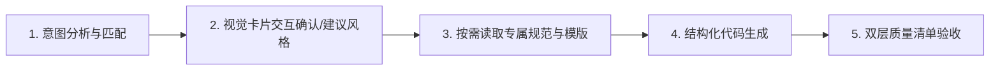

# Visual HTML — 模块化视觉设计与长文本排版系统

核心使命：**将长篇纯文本（如调研报告、方案白皮书、产品规划、技术总结、深度案例等）转换为结构清晰、高可读性、高辨识度且极具视觉美感的单文件 HTML 页面与 16:9 PPT 演示文稿**。

本 Skill 采用**插件化风格包（Pluggable Style Packs）**架构，在保证长文本排版骨架高可读性与结构一致性的同时，支持多种独立演进的视觉风格。

---

## 1. 风格注册表 (Style Registry)

当前系统内置的风格包列表。每种风格均包含独立的 `tokens.md`、`scaffold-web.html`、`scaffold-ppt.html` 与微缩视觉名片 `preview.svg`：
> 🎨 **全量画廊**：可直接在浏览器中打开 [style-gallery.html](file:///Users/mir/Library/Mobile%20Documents/com~apple~CloudDocs/work/skill/visual-html/references/style-gallery.html) 一站式对比与复制所有 11 种风格。

| Style ID | 风格名称 | 核心视觉特征 | 推荐场景与关键词 | 微缩预览与风格包 |
|---|---|---|---|---|
| **`industrial-dark`** | **暗色工业档案风**<br>(Industrial Dark) | 近黑背景 (`#090C0B`) + CAD 极淡网格 + 0–2px 硬边模块 + 信号绿 (`#67E38B`) + 紫色第二通道 | 硬件参数页、产品官网、工程文档、技术说明、极客展示、系统架构 | [预览名片](file:///Users/mir/Library/Mobile%20Documents/com~apple~CloudDocs/work/skill/visual-html/references/styles/industrial-dark/preview.svg)<br>`references/styles/industrial-dark/` |
| **`soft-sky`** | **柔空浅蓝风**<br>(Soft Sky) | 浅天蓝渐变背景 + 半透明白色卡片 + 8–16px 柔和圆角 + 同色系高阶蔚蓝 (`#0284C7`) 强调通道 | 包装展示、生活方式产品、消费级硬件、手账/文具、清新雅致向技术页 | [预览名片](file:///Users/mir/Library/Mobile%20Documents/com~apple~CloudDocs/work/skill/visual-html/references/styles/soft-sky/preview.svg)<br>`references/styles/soft-sky/` |
| **`obsidian-cyan`** | **黑曜霓蓝展示风**<br>(Obsidian Cyan) | 黑曜近黑底色 (`#0B0E14`) + 顶部冷蓝极光 + 悬浮设备模型 + 电光霓蓝 (`#38BDF8`) 信号与标注线 (Callout Pins) + 多步流程徽章 | UI/UX 案例集、移动端 App 展示、数字产品发布、前沿软件功能演示、高科技展厅 | [预览名片](file:///Users/mir/Library/Mobile%20Documents/com~apple~CloudDocs/work/skill/visual-html/references/styles/obsidian-cyan/preview.svg)<br>`references/styles/obsidian-cyan/` |
| **`neon-3d`** | **霓虹创意3D风**<br>(Neon 3D Creative) | 深邃黑紫底色 + 流体极光光晕 (Fluid Aurora Wave) + 胶片颗粒噪点 (Film Grain) + 3D浮雕高光卡片 + 霓虹紫/洋红通道 (`#A855F7` / `#EC4899`) | 工具集合展示、创意应用、潮酷硬件、潮流设计工作室、流体极光落地页、Vaporwave 风格 | [预览名片](file:///Users/mir/Library/Mobile%20Documents/com~apple~CloudDocs/work/skill/visual-html/references/styles/neon-3d/preview.svg)<br>`references/styles/neon-3d/` |
| **`pixel-pop`** | **手绘像素波普**<br>(Pixel Pop) | 青春亮蓝底色 (`#0055ff`) + 半调像素背景过渡 + 粗糙蜡笔涂鸦边缘与质感 + 悬浮像素碎片与图案 (Pixel Art) | 青春校园、创意活动、复古游戏、手账拼贴、动漫手绘风展示 | [预览名片](file:///Users/mir/Library/Mobile%20Documents/com~apple~CloudDocs/work/skill/visual-html/references/styles/pixel-pop/preview.svg)<br>`references/styles/pixel-pop/` |
| **`brutalist-acid`** | **酸性粗野海报风**<br>(Brutalist Acid) | 纯白高对比度画布 + 亮粉几何色块 (`#FF4591`) + 荧光青色 (`#00E5CC`) 超大字号标题 + 无规则排版与负字距 | 艺术展览、独立出版物、实验性排版、先锋设计展示、Acid Graphic 风格 | [预览名片](file:///Users/mir/Library/Mobile%20Documents/com~apple~CloudDocs/work/skill/visual-html/references/styles/brutalist-acid/preview.svg)<br>`references/styles/brutalist-acid/` |
| **`sunflower-bloom`** | **向日葵生机风**<br>(Sunflower Bloom) | 沉静纸质蓝背景 (`#4278A9`) + 米白奶油字 (`#F2EAE0`) + 向日葵明黄 (`#FFC300`) 高亮与强调色 + 粗大排版 | 产品海报、积极向上展示、生机活力传递、纸质文艺风格 | [预览名片](file:///Users/mir/Library/Mobile%20Documents/com~apple~CloudDocs/work/skill/visual-html/references/styles/sunflower-bloom/preview.svg)<br>`references/styles/sunflower-bloom/` |
| **`summer-dopamine`** | **多巴胺夏日风**<br>(Summer Dopamine) | 高饱和渐变网格背景 + 毛玻璃大圆角卡片 + 纯白与发光元素点缀 | 夏日活动、创意产品、汽水风格、多巴胺设计、元气海报 | [预览名片](file:///Users/mir/Library/Mobile%20Documents/com~apple~CloudDocs/work/skill/visual-html/references/styles/summer-dopamine/preview.svg)<br>`references/styles/summer-dopamine/` |
| **`warm-craft`** | **暖纸手作/温润社论风**<br>(Warm Craft Editorial) | 暖米纸质画布 (`#F7F4EC`) + 人文宋体大标题 (Editorial Serif) + 深橄榄绿行动通道 (`#323D24`) + 错落微倾粉彩贴纸 (`-2deg`~`+2deg`) + 手绘涂鸦 | 智能代理、知识沉淀、深度调研、SaaS 产品官网、人文科技、书籍出版物、温润工作流 | [预览名片](file:///Users/mir/Library/Mobile%20Documents/com~apple~CloudDocs/work/skill/visual-html/references/styles/warm-craft/preview.svg)<br>`references/styles/warm-craft/` |
| **`soft-editorial-future`** | **温润社论未来风**<br>(Soft Editorial Future) | 偏冷质感画布 + 高光悬浮玻璃展柜 + 内部色彩温润晕开的 3D 柔光彩球散布（边缘柔和自然） | 高级展厅、视觉画廊、艺术展落地页、前沿科技、AI产品 | [预览名片](file:///Users/mir/Library/Mobile%20Documents/com~apple~CloudDocs/work/skill/visual-html/references/styles/soft-editorial-future/preview.svg)<br>`references/styles/soft-editorial-future/` |
| **`play-tubular`** | **玩味工程彩管风**<br>(Play Tubular / Play Engineering) | 浅暖米白点阵画布 (`#FAF8F3`) + 粗圆鲜活 3D 渐变立体彩管/丝带环绕 + 球头末端与弯折处的 **半调网点 (Halftone Dot Matrix)** 光影 + 现代高对比度工程粗黑体 + 纯白大圆角弹簧动效卡片 | AI/LLM 创新展示、创意产品发布、工程技术白皮书、开发者大会、玩味科技落地页 | [预览名片](file:///Users/mir/Library/Mobile%20Documents/com~apple~CloudDocs/work/skill/visual-html/references/styles/play-tubular/preview.svg)<br>`references/styles/play-tubular/` |

> 💡 **未来扩展**：新增风格只需在 `references/styles/<style_id>/` 目录下添加标准规范、脚手架与 `preview.svg`，并同步在 `style-gallery.html` 与本表中注册即可。

---

## 2. 共享设计骨架 (Shared Skeleton DNA)

所有风格共享同一套信息骨架，确保任何风格下都具备高级的设计质感：

1. **信息结构本身就是视觉**：优先使用大字号标题、严格左对齐、模块化卡片、编号系统、标签、1px 细边框、Mono 等宽元数据与规格栏建立视觉身份，而非堆砌插画、3D、高光渐变与 emoji。
2. **克制优先于装饰**：
   - 能用排版解决就不加图形；能用边框解决就不加阴影；
   - 能用字号解决就不加颜色；能用留白解决就不加装饰；
   - 信号色仅占 3–7%，必须承担明确的语义/状态（如 Eyebrow 标头、序号、选中态、关键指标）。
3. **大标题负责观点，正文负责解释**：Hero 标题短小、字重大、有冲击力，支持中文语义主动换行；每页或每个 Section 只有一个唯一视觉焦点。

---

## 3. 标准执行工作流 (Standard Workflow)



### 第一步：意图分析与交互确认（视觉卡片推荐）

本 Skill 触发后，**不要直接生成全部代码**。首先分析用户需求与偏好：

1. **已明确指定**：若用户已明确指定风格（如“用浅蓝风”、“Industrial Dark”、“Play Tubular”），直接锁定对应 `style_id`。
2. **基于图像参考（多模态设计逆向工程）**：如果用户提供了一张**设计参考图**，请先执行解构分析：
   - 提取全局底色（背景）。
   - 提取核心信号色（品牌色、高光色、渐变色）。
   - 提取形状特征（圆角大小、卡片阴影质感、3D或扁平）。
   - 提取排版特征（字重、留白、边框风格）。
   - **完成分析后，严格遵守“Clean Room Design”法则，不要继承旧模板，直接从 `references/_base-scaffold-web.html` 读取基座并在其上编写全新 CSS**，以防止硬编码污染。
3. **智能推荐机制（输出 3～5 款视觉名片卡片）**：
   - 当用户提供了长文或排版需求但未锁定风格，或者意图较为宽泛时，分析文本特征并挑选 **最契合的 3～5 套风格**。
   - **强制交互规范**：在对话中**并发内嵌输出这 3～5 款风格的微缩视觉名片 (`preview.svg`)**，附带 1 句简明推荐理由：
     ```markdown
     ### 1. 玩味工程彩管风 (`play-tubular`)
     
     - 💡 **推荐理由**：适合 AI/LLM 架构与技术白皮书，3D彩管与半调网点极具创新活力。

     ### 2. 暗色工业档案风 (`industrial-dark`)
     
     - 💡 **推荐理由**：适合硬核技术规格与系统参数展示，CAD冷峻极客质感。

     ### 3. 暖纸手作/温润社论风 (`warm-craft`)
     
     - 💡 **推荐理由**：适合深度调研与知识沉淀，人文宋体与便签贴纸温润亲和。
     ```
   - **画廊全局入口**：在推荐卡片底部附带全局画廊入口，方便用户自主翻阅全部 11 种风格：
     > 🎨 **查看全部风格**：可在浏览器中打开 [全量风格画廊 (style-gallery.html)](file:///Users/mir/Library/Mobile%20Documents/com~apple~CloudDocs/work/skill/visual-html/references/style-gallery.html)
   - **引导确认**：询问用户期望使用的风格名称/序号以及目标媒介形式（**Web 响应式网页** 还是 **16:9 PPT 幻灯片**）。


### 第二步：按需精准读取 (On-Demand Loading)

确定风格与输出媒介后，调用 `view_file` 读取**且仅读取**目标风格的规范与脚手架，绝不把全部无关风格载入上下文：

- **读取目标 Token 规范**：`references/styles/<style_id>/tokens.md`
- **读取目标脚手架**：
  - Web 场景：`references/styles/<style_id>/scaffold-web.html`
  - PPT 场景：`references/styles/<style_id>/scaffold-ppt.html`
- **通用组件参考（可选）**：`references/shared-components.md`

### 第三步：代码生成优先级与动态组装 (Dynamic Assembly)

动手生成前必须遵循以下原则，**严禁被脚手架“模板化”**：

#### 1. 语义到组件映射决策树 (Semantic Mapping Matrix)
解析用户提供的长篇文本时，依照以下模式匹配规则动态选择最适宜的语义组件：

| 文本特征 / 逻辑类型 | 推荐组件与类名 | 结构化呈现方式 |
|---|---|---|
| **核心指标 / 关键硬件或系统参数** | `spec-row` (`.spec`, `.val`, `.unit`) | 提炼大号数字/规格与等宽英文单位 |
| **3–4 项并列功能 / 核心卖点** | `cards-3` (`.num-card`, `.num`, `.tag`) | 序号徽章 + 模块标题 + 详细说明（首推项加 `.selected`） |
| **软硬件图文特性 / 媒体演示说明** | `feat-grid` (`.feat-card`, `.tag`, `.frame`) | 类别标签 + 卖点标题 + 详细描述 + 媒体预览占位框 |
| **分步工作流 / 操作指南 / 执行计划** | `steps` (`.step`, `.idx`) | 递增步骤序号 + 阶段标题 + 步骤操作说明 |
| **多方案对比 / 版本差异 / 性能评测** | `cmp cmp-matrix` (`.row`, `.cell`, `.selected-col`) | 结构化矩阵表格，支持点/杠状态与高亮推荐列 |
| **双面评估 / 利弊分析 / 优劣榜** | `pros-cons` (`.pro-card`, `.con-card`) | 正负双向卡片 + 标签 + 结构化列表 |
| **时间跨度 / 发展演进 / 历史版本** | `timeline` (`.timeline-item`, `.timeline-marker`) | 年份/日期时间戳 + 关键里程碑事件 |
| **核心结论 / 重要警示 / 前置提醒** | `admonition` (`.info`, `.warning`, `.success`) | 语义边框高亮框 + 标头 + 提炼陈述 |
| **爆炸性宏观数据 / KPI 统计** | `stats-grid` (`.stat-card`, `.stat-val`, `.stat-label`) | 超大号百分比/数字 + 统计指标解释 |
| **系统架构 / 状态机 / 数据流图** | `flowchart` (`<svg>` 或 `<pre class="mermaid">`) | 零依赖纯矢量 SVG 或 Mermaid.js 自包含容器 |
| **长篇论述 / 深度背景 / 引用与列表** | `rich-text` (`p`, `blockquote`, `ul`, `code`) | 完整承载大段正文、粗体、代码块与引用，防止信息丢损 |
| **多轮访谈 / 需求推演 / 智能体人机协同** | `interview-rounds` (`.round-card`, `.ai-questions-block`, `.user-decision-note`) | 结构化问答推演卡 + 推荐方案便签 + 拍板决策回执 |
| **问答记录 / 疑难排解 / FAQ** | `faq` (`.faq-item`, `.q`, `.a`) | 结构化问答卡片对 |
| **多章节超长文档导航 (可选增强)** | `reading-progress` / `quick-nav` | 顶部平滑阅读进度条 + 悬浮快捷胶囊目录（纯净无横向滚动条） |

#### 2. 信息完整度与防偷懒契约 (Content Fidelity Contract)
- **严禁信息恶意损耗**：除非用户明确要求“摘要 / 提炼 / TL;DR”，否则必须保留原文所有的核心论据、技术细节、参数规格、代码示例与逻辑段落，严禁大幅删减 70% 原文内容。
- **严禁虚假生成与省略占位符**：绝对禁止在生成的 HTML 中输出 `<!-- 此处省略其余章节 -->` 或 `<!-- 更多内容 -->`。遇到无法归类到特殊卡片的长文本，**一律放入 `.rich-text` 正文容器中完整呈现**。

#### 3. 页面组装与设计法则 (Design Rules)
- **CSS 与组件提取（非页面复制）**：从脚手架中读取的内容仅为样式库与单组件 HTML 拼写样例。**绝对不允许照搬脚手架里的完整页面结构**。
- **Hierarchy (层级)**：确定本页唯一最重要的核心信息，用大字号 Hero 标题（支持中文主动换行）呈现，拒绝无主次平铺。
- **Signal Color (信号色)**：先改字重/字号 → 再用边框 → 最后才点缀信号色（3–7% 控制比例）。
- **Decoration (删装饰)**：删去不能表达层级、结构或技术语义的多余装饰。

---

### 第四步：双层质量清单校验 (Checklist)

生成完成后，按以下清单逐项验证：

#### 通用基础质检项：
- [ ] **信息保真度**：原文核心论据、参数与技术细节是否 100% 完整保留，无恶意删减与偷懒省略占位符？
- [ ] **视觉焦点**：页面或每页幻灯片是否有且仅有一个明确的主视觉焦点？
- [ ] **标头规范**：是否存在清晰规范的 Section Eyebrow（`◆` 标识 + 等宽大写编号 + 1px 细线）？
- [ ] **排版层级**：主标题字号是否足够大、短小有力，支持中文主动分行？
- [ ] **字体规范**：参数、序号、标签、Footer 元数据是否均使用 Mono 等宽字体？
- [ ] **克制留白**：留白是否充足，是否剔除了无意义的 emoji、弥散渐变、厚重投影与 3D 光效？
- [ ] **自包含单文件**：所有 CSS、SVG 图表与图标是否全部内联在单个 HTML 文件中，可本地离线双击打开？

#### 风格专属质检项：
- 执行从目标风格 `references/styles/<style_id>/tokens.md` 中读取的专属质量清单（如 Industrial Dark 的 0–2px 硬圆角校验、Soft Sky 的 8–16px 柔和圆角校验、Warm Craft 的宋体排版与无粗黑边便签回正校验、或 Play Tubular 的暖米白半调点阵底纹、3D 渐变彩管与半调网点光影质感校验）。

---

## 4. 场景设计与交付要点 (Web vs PPT)

### A. Web 响应式场景 (Responsive Web Page)
- 容器采用 `.wrap` 限制最大宽度（如 `1080px`–`1200px`）并水平居中。
- 移动端适配：配置 `@media (max-width: 768px)`，网格布局自动折叠为单列（`grid-template-columns: 1fr`），对比矩阵增加 `overflow-x: auto` 横向平滑滚动保护。
- 针对 4 章节以上的长篇文档，建议在顶部注入阅读进度条与目录导航。

### B. PPT 场景设计与演示要点 (16:9 Slides)
- **16:9 舞台布局**：画布固定为 16:9（如 `1280×720`），外层舞台居中展示，四周预留 5–7% 安全边距。
- **单页聚焦**：单页聚焦一个核心论点，严禁长文滚动；长卡片压成 3 个关键模块；对比使用模块化边框表格。
- **演示控制器与打印导出（推荐内置轻量脚本）**：
  * 支持键盘快捷键：`←` / `→` / `Space` 翻页，`F` 进入/退出全屏演示。
  * 内置 `@media print { @page { size: 16/9 landscape; margin: 0; } body { padding: 0; background: none; } .slide { break-after: page; width: 100vw; height: 100vh; } }`，方便用户直接在浏览器中按 `Cmd + P` / `Ctrl + P` 一键导出无边距高清 16:9 PDF。

---

## 5. 新增设计风格模板 (Template Extension)

> ⚠️ **注意**：如果用户要求新增、扩展或设计一套全新的视觉风格模板，请**不要**直接在本文件中查找或推理具体方法。
> 你需要直接读取并严格遵守 `references/template-extension-guide.md` 中的标准规范（S.O.P）进行目录创建、架构继承与变量定义。
