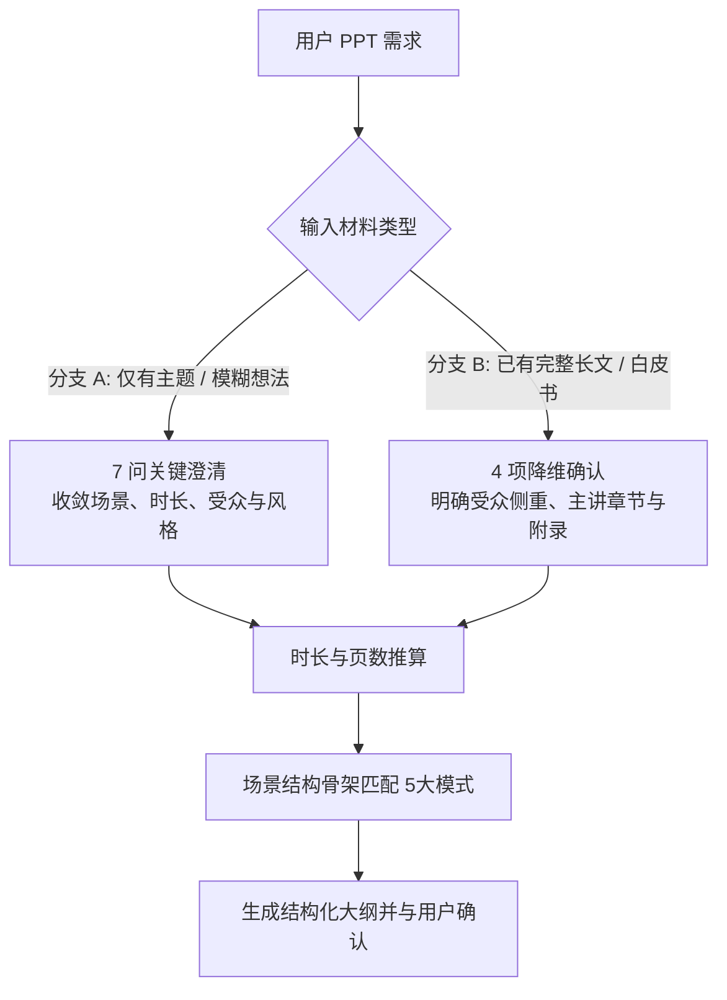

# PPT Outline & Narrative Framework (大纲与叙事架构指南)

本文件是 Generate PPT 路由的共享核心规范，定义了在编写 16:9 HTML 幻灯片代码之前，如何进行**需求澄清、长文提炼、场景骨架匹配与大纲结构化确认**。

无论是模糊想法还是万字长文，**严禁跳过本阶段直接编写代码**。必须先输出结构化大纲并与用户对齐确认。

---

## 1. 输入完备度诊断与前置对齐 (Stage 1)

根据用户输入材料的完备度，分流执行针对性的澄清与提炼策略：



### 分支 A：仅有主题或模糊想法（7 问澄清清单）
当用户只给了主题或几句要点时，通过以下维度快速对齐关键输入，不要基于猜测开工：

| # | 澄清维度 | 核心目的 | 选项与建议 |
|:---:|:---|:---|:---|
| **1** | **分享场景与受众** | 决定语言深度、专业术语密度与视觉调性 | 商业路演 / 管理层汇报 / 技术方案评审 / 行业大会 / 团队内训 |
| **2** | **分享时长** | 锁定幻灯片页数与讲解节奏 | 见下文时长换算表（15min ≈ 8-10页，30min ≈ 18-20页） |
| **3** | **视觉风格偏好** | 匹配最契合的设计语言 | 结合内容推荐 3~5 款已注册风格，并在对话内嵌 `preview.png` 图片供选 |
| **4** | **原始素材与数据** | 确定论据支撑 | 是否有现成文档、表格数据、旧 PPT 或相关参考链接 |
| **5** | **图片与截图处理** | 规划图文槽位与版式 | 是否有产品实机截图、架构图；是否需要重构或清洗 |
| **6** | **核心重点与主张** | 提炼全场核心 Takeaway | 本次分享必须让听众记住的一句话/核心结论 |
| **7** | **硬性约束与红线** | 避免后期推倒重来 | 必须出现的关键数据指标 / 严禁涉及的敏感信息或格式限制 |

---

### 分支 B：已有完整长文或研报（4 项降维确认）
PPT 是演讲演示媒介，**绝不是长文的文字切片或 Word 投影**。即使材料完整，也必须与用户确认以下提炼策略：

1. **受众定位与视角选择**：
   - *面向高管/决策层*：提取商业价值、核心战果、ROI 与战略规划；
   - *面向工程师/技术评审*：提取架构拓扑、技术选型权衡、SLA 指标与实施细节。
2. **重点主讲章节 vs 略讲章节**：
   - 梳理出主线逻辑（3~5 个核心论点），将背景说明压缩为 1~2 页定调，次要章节一笔带过。
3. **时长与总页数约束**：
   - 明确本次演示的时长限制，严格控制主幻灯片页数，避免单页文字过密。
4. **附录备查页（Appendix）剥离**：
   - 将长文中的完整技术参数表、大段配置代码、辅助证明材料放入末尾附录页，主屏只放大结论。

---

## 2. 时长与页数换算黄金法则

幻灯片页数必须严格受演讲时长约束，单页平均停留时间约为 **1.5 ~ 2 分钟**。严禁在有限时间内塞入过多页面：

| 分享时长 | 建议主幻灯片页数 | 附录备查页 | 适用场景 |
|:---|:---:|:---:|:---|
| **5 ~ 10 分钟 (Lightning / Pitch)** | 5 ~ 7 页 | 1 ~ 2 页 | Demo Day、闪电演讲、每日站会 |
| **15 ~ 20 分钟 (Standard Talk)** | 8 ~ 12 页 | 2 ~ 3 页 | 部门周会、常规方案汇报、大会分论坛 |
| **30 ~ 45 分钟 (Deep Dive / Keynote)** | 16 ~ 24 页 | 3 ~ 5 页 | 技术方案深度评审、大会主旨演讲、产品发布会 |
| **60 分钟及以上 (Workshop / Training)** | 25 ~ 35 页 | 5+ 页 | 团队深度培训、全天工作坊（建议分节） |

> 💡 **90% 时长缓冲原则**：大纲规划的单页建议时长总和**不得超过用户总时长的 90%**，预留 10% 缓冲时间应对现场互动、设备调试与问答。

---

## 3. 场景驱动的 5 大演示结构骨架（弹性选用，严禁锁死）

根据演示内容与目标，智能匹配或启发大纲骨架。**结构服务于内容，严禁机械套用公式**。

### 模式 1：商业路演 / 创新发布型 (Dramatic & Pitch)
*适用：产品发布会、Demo Day、融资路演、创新提案*
1. **痛点与反差 (Hook)**：行业痛点、反直觉现状或震撼数据（吸引注意力）
2. **愿景与方案 (Vision)**：我们带来的颠覆性解决思路
3. **核心功能与演示 (Core & Demo)**：产品亮点、魔法时刻（Magic Moment）与实机展示
4. **商业壁垒与成绩 (Traction)**：市场规模、增长曲线、核心壁垒与客户背书
5. **行动召唤 (Call to Action)**：合作呼吁 / 开启公测 / 融资规划

### 模式 2：管理层汇报 / 业绩复盘型 (Executive & Pyramid)
*适用：月度/季度复盘、高管决策汇报、战役复盘、KPI 述职*
1. **全景结论 (Executive Summary)**：结论先行，1 页概括核心战果、ROI 与战略达成度
2. **核心亮点与归因 (Wins & Highlights)**：关键指标达成情况、超预期增长点及其核心推手
3. **问题与深层根因 (Gaps & Root Cause)**：未达预期的短板、瓶颈与数据归因剖析
4. **战略打法与规划 (Next Steps & Strategy)**：下阶段核心战役、打法路径与里程碑
5. **资源支持与诉求 (Asks & Support)**：需要跨部门协同的资源、预算或组织支持

### 模式 3：技术架构 / 方案评审型 (Technical & Engineering)
*适用：技术选型评审、架构设计、技术演进汇报、稳定性专项*
1. **背景与设计目标 (Context & SLA)**：业务诉求、系统核心瓶颈与性能/可用性目标
2. **技术选型与权衡 (Trade-offs)**：各备选方案对比矩阵（优缺点、成本、复杂度）与选型依据
3. **系统核心架构 (Architecture & Flow)**：模块拓扑图、核心数据流向与关键时序图
4. **高可用与兜底保障 (Reliability & Scale)**：容灾方案、容量规划、降级熔断与监控体系
5. **实施演进路线 (Rollout & Milestones)**：灰度发布策略、数据迁移步骤与风险应急预案

### 模式 4：培训教学 / 知识赋能型 (Educational & Enablement)
*适用：团队内训、技术分享、新人培训、操作指南*
1. **概念与价值 (What & Why)**：为什么需要掌握这项技能？能解决什么实际问题？
2. **核心原理解析 (How it Works)**：核心概念定义与底层运行机制拆解
3. **案例演练走查 (Step-by-step Demo)**：真实场景全流程演示与最佳实践拆解
4. **踩坑指南与避雷 (Pitfalls & Tips)**：典型错误用法、高频问题与排查思路
5. **要点沉淀与行动 (Summary & Exercises)**：核心知识清单、课后练习与延伸资料

### 模式 5：原文衍生 / 自由编排型 (Custom / Source-Derived)
*适用：长篇研报本身具备严密内在逻辑，或用户有特定的叙事结构要求*
- **完全尊重原文的逻辑流**，提炼各章节的“核心主张 + 关键证据”，按需重构成适合 16:9 大屏呈现的节奏。

---

## 4. 大纲确认标准交付模板 (Stage 2 产物)

在大纲梳理完成后，必须以 Markdown 形式完整呈现给用户进行确认。格式如下：

```markdown
# [演示文稿标题] — 大纲与演讲规划

## 1. 基础元数据
- **演讲主题**：[清晰的主题名称]
- **目标场景与受众**：[如：技术架构评审委员会]
- **分享总时长**：[如：20 分钟]
- **规划页数**：[如：共 10 页正文 + 2 页附录备查]
- **选用结构模式**：[如：模式 3 · 技术架构评审型]
- **推荐/拟用风格**：[`style_id`，附核心视觉特征说明]

## 2. 幻灯片逐页规划表

| 页码 | 页面 ID (`data-slide-id`) | 章节定位 | 页面核心目的 | 观众可见内容（屏幕展示） | 演讲者提词要点（口头补充） | 建议时长 |
|:---:|:---|:---|:---|:---|:---|:---:|
| P01 | `cover` | 封面 | 确立主题与演讲身份 | 大标题、副标题、分享人与部门 | • 简短致辞<br>• 点明今天解决的核心业务痛点 | 1 min |
| P02 | `sla-goals` | 目标与指标 | 建立量化约束共识 | 3 项核心 SLA 目标对比卡片 | • 强调 QPS 从 5k 跃升至 50k 的严峻挑战<br>• 说明 99.99% 可用性是硬约束 | 1.5 min |
| P03 | `tech-matrix` | 选型权衡 | 论证方案合理性 | 3 方案对比矩阵图 | • 分析方案 A 的性能劣势与方案 B 的维护成本<br>• 明确选用当前方案的决定性理由 | 2 min |
| ... | ... | ... | ... | ... | ... | ... |
| P11 | `app-config` | 附录 | 备查技术参数 | 完整 YAML 配置与字段说明 | （现场 Q&A 涉及细节实现时切换查看） | 备查 |

---
**确认提示**：请审阅以上大纲结构、重点分配与提词规划。确认满意后，我们将正式开始编写高保真 16:9 HTML 幻灯片！
```
