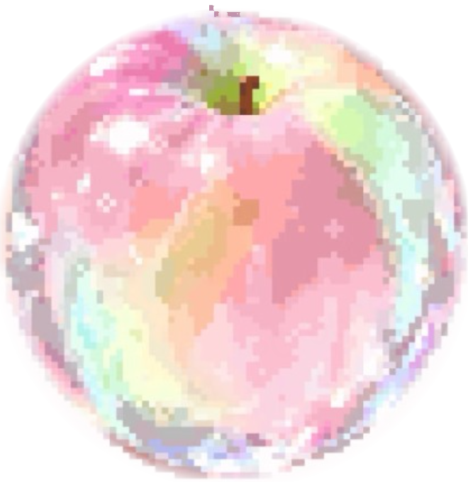

# Pixel Crystal (油画粉彩晶光风 / Monet Crystal & Iridescent DNA) — Design Language Reference

## 1. Visual Theme & Atmosphere

Pixel Crystal（油画粉彩晶光风 / Monet Crystal & Iridescent DNA）从根本上彻底破除传统 Web 模板的“僵化格式化方块”感，将莫奈印象派油画（Monet Impressionist Palette）中流光溢彩的光影层次、点彩派（Pointillism）柔光星尘与晶透水钻玻璃折射融合为一套充满艺术灵性与高级质感的设计系统。

### 核心空间与材质哲学 (3-Tier Canvas & Crystal DNA)

1. **Layer 0: 环境背景层（`<div class="ambient-stars-bg">`）**：
   - 页面背景通铺 45° 细密油画布纹（Linen Weave Pattern）与莫奈复调柔光光晕（暖粉、冷紫藤、开心果绿漫射）。
   - 错落散布大小深浅不一的悬浮微光晶珠与点彩星斑，营造出深邃空灵的景深。
2. **Hero 晶透苹果主视觉展台（`<div class="hero-crystal-showcase">`，灵魂视觉中心）**：
   - 告别单调纯文本平铺，在首屏构建与 Hero 大标题交融的 **晶透苹果光影展台**：中心搭载原版高保真莫奈晶透像素苹果，环绕 3 层莫奈复调同心光晕波纹与浮动点彩气泡，瞬间锁定全场视觉焦点。
3. **Layer 1: 珍珠母贝琉璃承托画板（`<main class="main-sheet">`）**：
   - 采用温润半透的珍珠母贝琉璃材质（`rgba(255, 253, 252, 0.94)`，搭配 `backdrop-filter: blur(24px)`），边缘带有 1px 细微粉金油画微光，与背景自然融合，拒绝生硬死白大方块。
4. **Layer 2: 琉璃粉彩磨砂具象组件（Frosted Iridescent Glass Components）**：
   - **指标看板（`.stat-card`）**：莫奈点彩星斑水晶棱柱台（24px 珍珠母贝磨砂底板 + 双端羽化极细流光丝 + 熟褐暗茜草大号雕刻字 + 晶透水钻微标与呼吸圆点）。
   - **特性卡片（`.num-card`）**：**晶透果球序号徽章 (3D Crystal Orb Badge)** 替代生硬方形色块，卡片自带顶层油彩高光内阴影（`inset 0 1.5px 0 rgba(255,255,255,0.95)`）与弹簧轻跃动效。
   - **提示告警（`.admonition`）**：**莫奈点彩手记便笺 (Illuminated Manuscript Notes)**，珍珠母贝微透底板搭配 3D 点彩水钻印戳与晨曦柔光浸润。
   - **规格矩阵（`.spec-row`）**：晶石工艺标尺，配备点彩珠分隔符与温润熟褐等宽排版。

---

## 2. Color Palette & Tokens

### Core Interface Colors

| Role | Value | Hex / RGBA | CSS Token | Usage |
|---|---|---|---|---|
| Background (Canvas Linen) | `rgb(253, 248, 247)` | `#FDF8F7` | `--bg` | 全局油画布暖奶粉底色 |
| Background (Glaze Subtle) | `rgb(250, 242, 244)` | `#FAF2F4` | `--bg-subtle` | 局部油画微过渡、次级背景 |
| Board Surface (Main Sheet)| `rgba(255, 253, 252, 0.70)`| `rgba(255,253,252,.70)`| `--bg-plate` | 高透珍珠母贝琉璃主画板 |
| Surface (Frosted Glass Card)| `rgba(255, 255, 255, 0.72)`| `rgba(255,255,255,.72)`| `--bg-card` | 内部琉璃磨砂微透卡片底色 |
| Surface (Card Glaze Tint) | `rgba(253, 244, 246, 0.55)`| `rgba(253,244,246,.55)`| `--bg-card-tint` | 浅粉晶透次级卡片底色 |
| Text (Madder Dark Brown) | `rgb(60, 40, 54)` | `#3C2836` | `--text-primary` | 高级熟褐暗茜草主标题、核心文字 |
| Text (Dusty Wisteria Rose) | `rgb(107, 79, 96)` | `#6B4F60` | `--text-secondary` | 烟粉紫灰正文段落、导读副标题 |
| Text (Muted Glaze Mauve) | `rgb(156, 124, 142)` | `#9C7C8E` | `--text-muted` | 占位符、注释、等宽元数据标签 |
| Border (Prismatic Subtle) | `rgba(230, 195, 205, 0.55)`| `rgba(230,195,205,.55)`| `--border` | 1px 细微粉金琉璃边框 |
| Border (Strong / Active) | `rgb(216, 140, 168)` | `#D88CA8` | `--border-active` | 活跃推荐卡片边框、高亮轮廓 |

### Monet Iridescent Multi-Stop Gradients (莫奈复调渐变)

| Gradient Name | CSS Value | Usage |
|---|---|---|
| `--grad-oil-crystal` | `linear-gradient(135deg, #F2A7B8 0%, #E8B4D9 22%, #C5B9E8 45%, #B8E2DC 70%, #E4E8B0 88%, #F7D6B8 100%)` | 核心莫奈复调主渐变 |
| `--grad-peach-glaze` | `linear-gradient(135deg, #F7B8C4 0%, #EFA5BA 40%, #D88CA8 75%, #C27494 100%)` | 熟桃粉霞厚涂渐变 |
| `--grad-pistachio-sky` | `linear-gradient(135deg, #D4E8B8 0%, #BFE2D5 45%, #BAD8E8 100%)` | 开心果绿与晴空青冷色渐变 |
| `--grad-wisteria-cream` | `linear-gradient(135deg, #E6D8ED 0%, #F5E5D8 50%, #FADCE6 100%)` | 紫藤香草奶油暖调渐变 |

### CSS Design Tokens

```css
:root {
  /* 背景层：油画布肌理与高透琉璃磨砂 */
  --bg: #FDF8F7;
  --bg-subtle: #FAF2F4;
  --bg-plate: rgba(255, 253, 252, 0.70);
  --bg-card: rgba(255, 255, 255, 0.72);
  --bg-card-tint: rgba(253, 244, 246, 0.55);
  --bg-card-subtle: #FAF7FB;
  --bg-code: #2A1D27;

  /* 文字墨色层（高级熟褐暗茜草） */
  --text-primary: #3C2836;
  --text-secondary: #6B4F60;
  --text-muted: #9C7C8E;
  --text-subtle: #C4AAB8;
  --text-inverse: #FFFFFF;

  /* 核心油画复调渐变 */
  --grad-oil-crystal: linear-gradient(135deg, #F2A7B8 0%, #E8B4D9 22%, #C5B9E8 45%, #B8E2DC 70%, #E4E8B0 88%, #F7D6B8 100%);
  --grad-peach-glaze: linear-gradient(135deg, #F7B8C4 0%, #EFA5BA 40%, #D88CA8 75%, #C27494 100%);
  --grad-pistachio-sky: linear-gradient(135deg, #D4E8B8 0%, #BFE2D5 45%, #BAD8E8 100%);
  --grad-wisteria-cream: linear-gradient(135deg, #E6D8ED 0%, #F5E5D8 50%, #FADCE6 100%);

  /* 边框与油画漫反射投影 */
  --border: rgba(230, 195, 205, 0.55);
  --border-strong: rgba(216, 140, 168, 0.75);
  --border-active: #D88CA8;
  
  --shadow-sheet: 0 24px 60px rgba(194, 89, 117, 0.09), 0 4px 18px rgba(142, 74, 92, 0.05);
  --shadow-card: inset 0 1.5px 0 rgba(255, 255, 255, 0.95), 0 8px 24px rgba(194, 89, 117, 0.07), 0 2px 6px rgba(60, 40, 54, 0.03);
  --shadow-card-hover: inset 0 1.5px 0 rgba(255, 255, 255, 1), 0 18px 40px rgba(194, 89, 117, 0.16), 0 6px 16px rgba(197, 185, 232, 0.14);
  --shadow-orb: 0 8px 24px rgba(242, 167, 184, 0.4), inset 0 2px 4px rgba(255, 255, 255, 0.9);

  /* 尺寸与圆角 */
  --radius-lg: 30px;
  --radius-md: 20px;
  --radius-sm: 12px;
  --radius-pill: 999px;
  --container: 1160px;

  /* 字体栈 */
  --font-display: "Plus Jakarta Sans", "Inter", -apple-system, BlinkMacSystemFont, "Segoe UI", "PingFang SC", sans-serif;
  --font-mono: "IBM Plex Mono", "JetBrains Mono", Consolas, monospace;
}
```

---

## 3. Mandatory Skeleton Contract (强制结构契约)

生成任何 Pixel Crystal 页面时，必须严格保留以下外层空间架构：

```html
<!DOCTYPE html>
<html lang="zh-CN">
<head>
  <!-- 字体与 Tokens -->
</head>
<body>

<!-- 1. 全景油画布纹与莫奈微光层 (Layer 0 Ambient) -->
<div class="ambient-stars-bg" aria-hidden="true">
  <svg viewBox="0 0 1440 900" preserveAspectRatio="xMidYMid slice" xmlns="http://www.w3.org/2000/svg">
    <defs>
      <!-- 45度细密布纹 -->
      <pattern id="pc-linen" width="20" height="20" patternUnits="userSpaceOnUse" patternTransform="rotate(45)">
        <rect x="0" y="0" width="20" height="20" fill="none" stroke="rgba(216, 140, 168, 0.06)" stroke-width="0.8"/>
        <line x1="0" y1="10" x2="20" y2="10" stroke="rgba(216, 140, 168, 0.04)" stroke-width="0.5"/>
        <line x1="10" y1="0" x2="10" y2="20" stroke="rgba(216, 140, 168, 0.04)" stroke-width="0.5"/>
      </pattern>
      <!-- 莫奈柔光 -->
      <radialGradient id="pc-glow-1" cx="18%" cy="18%" r="48%">
        <stop offset="0%" stop-color="#FCE7EE" stop-opacity="0.75"/>
        <stop offset="100%" stop-color="#FDF8F7" stop-opacity="0"/>
      </radialGradient>
      <radialGradient id="pc-glow-2" cx="82%" cy="28%" r="52%">
        <stop offset="0%" stop-color="#EBE4F7" stop-opacity="0.65"/>
        <stop offset="100%" stop-color="#FDF8F7" stop-opacity="0"/>
      </radialGradient>
    </defs>
    <rect width="100%" height="100%" fill="#FDF8F7"/>
    <rect width="100%" height="100%" fill="url(#pc-glow-1)"/>
    <rect width="100%" height="100%" fill="url(#pc-glow-2)"/>
    <rect width="100%" height="100%" fill="url(#pc-linen)"/>
  </svg>
</div>

<!-- 4 节点景深悬浮晶透苹果图腾 (4-Point Apple Constellation) -->
<div class="ambient-decor-apple pos-top-right" aria-hidden="true">
  
</div>
<div class="ambient-decor-apple pos-mid-left" aria-hidden="true">
  
</div>
<div class="ambient-decor-apple pos-mid-right" aria-hidden="true">
  
</div>
<div class="ambient-decor-apple pos-bottom-left" aria-hidden="true">
  
</div>

<!-- 2. 珍珠母贝微透琉璃画板 (Layer 1 Carrier Sheet) -->
<main class="main-sheet">
  <div class="wrap">
    
    <!-- PHASE 1: HERO SECTION -->
    <section class="hero-section" id="section-summary">
      <div class="eyebrow">
        <span class="sparkle">✦</span>
        <span>01 / EXECUTIVE SUMMARY</span>
        <span class="line"></span>
      </div>
      <h1 class="hero">油画粉彩晶光架构<br><span class="highlight">莫奈光影与现代排版</span></h1>
      <p class="lead">导读段落...</p>

      <!-- Stats Grid & Spec Row -->
    </section>

    <!-- Phase 2~5 业务组件 -->
  </div>
</main>

</body>
</html>
```

---

## 4. Typography Scale & Rules

| Element | Class / Selector | Size | Weight | Line Height | Letter Spacing | Role |
|---|---|---|---|---|---|---|
| Section Eyebrow | `.eyebrow` | `11px` | `700` | `1.2` | `+0.12em` | 等宽大写章节序号与点彩星芒前缀 |
| Hero Title | `h1.hero` | `clamp(34px, 5.2vw, 54px)` | `800` | `1.18` | `-0.025em` | 醒目主标题，沉稳大气 |
| Lead Text | `p.lead` | `clamp(16px, 1.8vw, 19px)` | `500` | `1.65` | `-0.01em` | 导读段落，建立第一层宏观认知 |
| Section Title | `h2.section-title` | `clamp(24px, 3.2vw, 34px)` | `800` | `1.25` | `-0.02em` | 章节主标题 |
| Sub Title | `h3.card-title` | `18px` | `700` | `1.35` | `-0.01em` | 模块/卡片标题 |
| Body Text | `p`, `li` | `15px` | `450` | `1.72` | `0` | 深度论述与说明正文 |
| Metric Value | `.stat-val`, `.spec .val` | `clamp(36px, 4.5vw, 52px)` | `800` | `1.05` | `-0.03em` | 核心数字与指标看板 |
| Mono Label | `.stat-label`, `.tag`, `code`| `11px` | `700` | `1.3` | `+0.06em` | 等宽标签、元数据、参数单位 |

---

## 5. Signature Component Patterns (具象组件片段)

### 1. 晶透果球序号卡片 (Cards-3 with 3D Crystal Orb Badge)
```html
<div class="num-card selected">
  <div class="crystal-orb-badge">01</div>
  <div class="card-content">
    <div class="tag">FLAGSHIP / 核心引擎</div>
    <h3 class="card-title">油画复调多模态解析</h3>
    <p class="card-desc">深度挖掘非结构化多模态数据，通过高精度语义锚点实现秒级知识对齐与推演。</p>
  </div>
</div>
```

### 2. 莫奈点彩手记便笺 (Illuminated Manuscript Admonition with Stardust Seal)
```html
<div class="admonition info">
  <div class="admonition-header">
    <span class="admonition-seal">✦</span>
    <span class="admonition-tag">INFO // 核心结论</span>
    <div class="admonition-title">Clean Room 设计规范</div>
  </div>
  <p>这是从长文中提取的关键结论高亮框，采用珍珠母贝微透底板与莫奈晨曦柔光微染。</p>
</div>
```

### 3. 晶石工艺标尺规格行 (Crystal Spec Matrix)
```html
<div class="spec-row">
  <div class="spec">
    <div class="val">60×95<em>mm</em></div>
    <div class="unit">SIZE / 尺寸</div>
  </div>
  <div class="spec-divider">✦</div>
  <div class="spec">
    <div class="val">500<em>mah</em></div>
    <div class="unit">BATTERY / 电池</div>
  </div>
  <div class="spec-divider">✦</div>
  <div class="spec">
    <div class="val">USB-C</div>
    <div class="unit">INTERFACE / 接口</div>
  </div>
</div>
```

### 4. 莫奈点彩星斑水晶棱柱台 (Prismatic Crystal Pillar Stats Card)
```html
<div class="stat-card">
  <div class="stat-val">300<span class="unit">%</span></div>
  <div class="stat-label"><span class="dot"></span><span>ANNUAL GROWTH / 年度复合增长</span></div>
</div>
```

---

## 6. Do's and Don'ts (7 项金律与 7 项严禁红线)

### 7 项核心金律 (Do's)
1. **Hero 必须配备晶透苹果主视觉展台**：Hero 首屏必须有机融合苹果光影展台，作为灵魂视觉锚点。
2. **卡片必须使用琉璃粉彩磨砂材质**：必须配置 `backdrop-filter: blur` 与 `inset 0 1.5px 0 rgba(255,255,255,0.95)` 油彩高光内阴影。
3. **正文严格使用熟褐暗茜草墨色**：严格使用 `--text-primary` (`#3C2836`) 与 `--text-secondary` (`#6B4F60`)。
4. **数字卡片与时间轴必须使用 3D 晶透果球序号徽章**：杜绝生硬平淡的直角单色小方块与单调细线。
5. **提示框采用彩绘玻璃半透便签质感**：配备彩绘玻璃 Pill 胶囊 Badge 与柔润半透光晕内衬。
6. **引用块（Blockquote）采用 20px 珍珠母贝大圆角与双引号晶光**：杜绝传统生硬的左侧单边粗实线与直角。
7. **全交互配备轻盈弹簧回弹动效**：遵循 `cubic-bezier(0.34, 1.56, 0.64, 1)`。

### 7 项严禁红线 (Don'ts)
1. **严禁使用死白生硬卡片（#FFFFFF 纯方盒）**：严禁退化为千篇一律的白卡片。
2. **严禁使用单色生硬直角方块作为序号**：必须使用晶透果球序号徽章。
3. **严禁在提示框或引用块上使用传统生硬的左粗边框（`border-left`）或 0px 直角**。
4. **严禁使用刺眼高饱和纯红纯蓝霓虹色**：严格遵守莫奈复调油画色盘。
5. **严禁使用低对比度浅粉色文字作为正文**：正文必须保证 WCAG AAA 对比度。
6. **严禁堆砌无意义的 emoji 装饰**：用精细的点彩 SVG 与 Mono 编号构建秩序。
7. **严禁省略正文的关键信息或破坏原有结构**：按内容语义选用组件，必须保证 100% 内容保真；不得为了凑齐组件而虚构内容。

## 7. Component State Matrix (组件状态矩阵)

| Component | Default | Hover | Focus-visible | Selected / Active | Disabled |
|---|---|---|---|---|---|
| `.num-card` | 半透琉璃底、柔和阴影 | 上移 4px，增强油彩高光和阴影 | `2px` 粉金色外描边 | 使用 `--border-active` 与晶透果球高亮 | 降低透明度，不移除文字对比度 |
| `.admonition` | 粉彩玻璃覆层 | 提升背景不透明度 | 显示清晰的粉金色 focus ring | 保留点彩角标与语义色 | 禁止使用低对比度浅粉正文 |
| `.btn` / interactive | 珍珠白或复调渐变底 | 弹簧回弹，阴影扩散 | 保留可见外描边 | 显示选中态文本与图标 | 保持布局尺寸，仅降低透明度 |

## 8. Spacing, Elevation & Motion (间距、海拔与动效)

- 间距以 `4px` 为基础单位，常用节奏为 `4 / 8 / 12 / 16 / 24 / 32 / 48px`。
- Layer 1 画板使用 `--shadow-sheet`；普通卡片使用 `--shadow-card`；交互悬停使用 `--shadow-card-hover`。不得用更重的黑色投影覆盖油画材质。
- 交互动效统一使用 `cubic-bezier(0.34, 1.56, 0.64, 1)`，位移控制在 `4px` 以内；页面首次加载不得有持续闪烁。
- 尊重 `prefers-reduced-motion: reduce`，关闭弹簧位移和持续漂浮，只保留颜色/边框状态变化。

## 9. Responsive & Accessibility (响应式与可访问性)

| Viewport | Layout rule |
|---|---|
| `> 1100px` | 珍珠母贝画板最大宽度 `1160px`，Hero 图腾可保留四点景深布局 |
| `769px–1100px` | 收窄画板内边距，特性卡片从三列降为两列 |
| `<= 768px` | 单列流式布局，Hero 图腾缩小并移至标题下方，矩阵允许横向滚动 |
| `<= 480px` | 取消大范围装饰晶珠，正文最小字号保持 `15px`，避免标题和数字溢出 |

- 所有装饰苹果和背景晶珠使用 `aria-hidden="true"`；信息型图表必须提供可读文本或 `aria-label`。
- 正文和交互控件必须满足 WCAG AA 对比度；不能用浅粉色作为唯一的信息编码。
- 所有键盘可操作元素必须有可见 `:focus-visible` 状态。

---

## 6. Mermaid Theme Configuration (在线增强与离线降级)

在线增强时，在 `</body>` 前注入以下匹配油画粉彩晶光风的 `themeVariables`；最终交付仍需使用 `references/scripts/bundle_offline.py` 生成静态 SVG fallback：

```js
mermaid.initialize({
  startOnLoad: true,
  theme: "base",
  themeVariables: {
    darkMode: false,
    background: "#FDF8F7",
    primaryColor: "#FAF2F4",
    primaryTextColor: "#3C2836",
    primaryBorderColor: "#D88CA8",
    lineColor: "#D88CA8",
    secondaryColor: "#FAF2F4",
    tertiaryColor: "#FFFFFF",
    fontFamily: ""Plus Jakarta Sans", sans-serif"
  }
});
```
